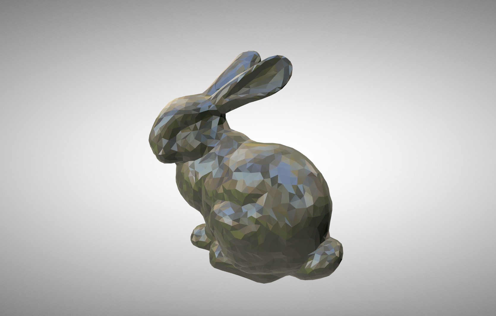

# glTF-converter

A `BLEND`, `COLLADA`, `FBX` and `OBJ` to `GLTF2` converter using [Blender](https://www.blender.org/download/) and [glTF Blender Exporter](https://github.com/KhronosGroup/glTF-Blender-Exporter).

`3ds` is currently not supported as it does not convert correctly.

Based on the ideas of [2gltf2](https://github.com/ux3d/2gltf2) by [Norbert Nopper](https://twitter.com/McNopper). I wasn't able to get their repo working on MacOS and it was missing installation instructions.

Please note that the current version is highly experimental. Do not use this in your production workflow as of now. 

## Run
Run `blender -b -P gltf-converter.py -- <input> <output>`. A `.gltf` file and a `.bin` file will be written.

## General installation instructions
Installation instructions can be found on [glTF Blender Exporter Scripts](https://github.com/KhronosGroup/glTF-Blender-Exporter/tree/master/scripts).

## Specific installation instructions for Mac
Install [Blender](https://www.blender.org/download/) and drag to the `Applications` folder. On install a binary should be written to `/usr/local/bin/blender` that can be verified using `which blender`.

Open Blender and see if it starts correctly. If you do these adjustments before opening Blender you will likely run into a verification hash issue that MacOS does on every install.

Copy `io_scene_gltf2` from [glTF Blender Exporter Addons](https://github.com/KhronosGroup/glTF-Blender-Exporter/tree/master/scripts/addons).

Select `Blender` and right click `show package contents -> Contents -> Resources -> 2.79 -> scripts -> addons`.

Place `io_scene_gltf2` in there. Open `Blender -> File -> User preferences -> Add-ons tab -> Toggle on Import-Export: glTF 2.0 format > Save user settings > Refresh`.

You should now be able to export scenes as glTF from the dropdown menu `File -> glTF 2.0 (.glb)` and `glTF 2.0 (.gltf)`.

## Preperation
Remove the default `cube` scene by following the [instructions](https://blender.stackexchange.com/questions/5574/how-to-remove-the-default-cube) otherwise you will have an extra cube in your export.

## Validate
To validate the exported `.gltf` and `.bin`, select both (include textures if your model has them) and drag and drop them into the [glTF Viewer](https://gltf-viewer.donmccurdy.com/).

## Licence
Released under the MIT licence, further details available in the included `LICENCE`.